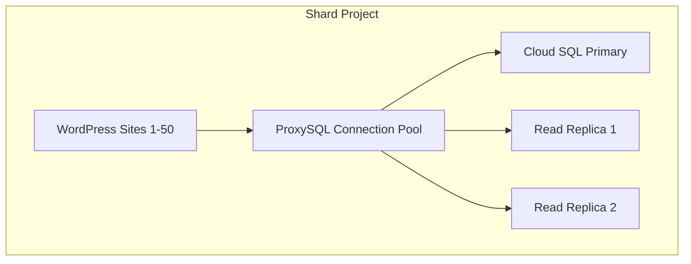
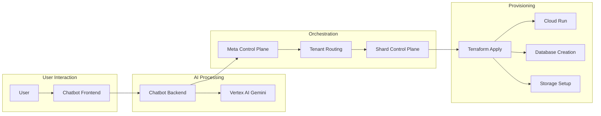
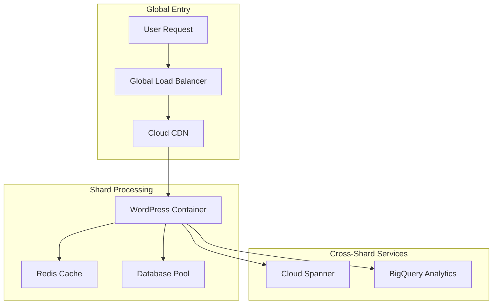

# AIPress Platform Architecture Overview - Production Scale

## 1. Vision

AIPress is a highly scalable, performant, cost-effective, and user-friendly WordPress hosting platform built on Google Cloud Platform (GCP). It leverages a conversational AI interface (powered by Google Gemini) for site creation, management, and operational insights, capable of hosting 50,000+ WordPress sites globally.

## 2. Core Principles

*   **Massive Scalability:** Multi-project federation architecture overcoming GCP service limits, designed to scale to 50,000+ sites
*   **Performance at Scale:** Global CDN, multi-layer caching, and AI-driven optimization for <100ms response times worldwide
*   **Cost Efficiency:** Shared resources, connection pooling, and AI-driven resource optimization achieving <$3/site/month
*   **Strong Isolation:** Project-level tenant isolation with shared resources for cost optimization
*   **Stateless Design:** WordPress containers remain stateless with external managed services for all persistent data
*   **AI-Driven Operations:** Natural language interface plus AI-powered performance and cost optimization

## 3. Architecture Overview

### Current vs. Target Architecture Evolution

#### PoC Architecture (Current)
```
Single GCP Project: wp-engine-ziggy
├── Control Plane (Cloud Run)
├── WordPress Sites (Cloud Run, limited to ~1,000)
├── Databases (Cloud SQL, 1 per tenant - expensive)
└── Storage (GCS, 1 bucket per tenant)
```

#### Production Architecture (Target)
```
Organization: aipress-hosting
├── Meta Control Plane Project
│   ├── Meta Control Plane API
│   ├── Tenant Routing Service
│   └── Project Management
├── Shared Services Project
│   ├── Cloud Spanner (Global Metadata)
│   ├── BigQuery (Analytics & Billing)
│   └── Global CDN Configuration
├── 1,000 Shard Projects (50 sites each)
│   ├── Shard Control Plane
│   ├── 50 WordPress Cloud Run Services
│   ├── 1 Shared Cloud SQL Instance
│   ├── ProxySQL Connection Pool
│   ├── Shared Memorystore Redis
│   └── Shared GCS Bucket
└── Global Infrastructure
    ├── Multi-region deployment
    ├── Global Load Balancing
    └── Cross-region backup
```

## 4. Key Components - Production Scale

**📋 IMPLEMENTATION STATUS LEGEND:**
- ✅ **IMPLEMENTED** - Code exists, ready for deployment
- ⚠️ **NEEDS TESTING** - Built but not validated
- 📋 **PLANNED** - Designed but not built
- ❌ **NOT STARTED** - Not yet begun

### 4.1 Meta Control Plane Layer ✅ **IMPLEMENTED**

#### **Meta Control Plane API** ✅ **IMPLEMENTED**
*   **Purpose:** Central orchestrator managing 1,000+ project shards
*   **Technology:** FastAPI service in dedicated project
*   **Responsibilities:**
    *   Tenant-to-shard routing using consistent hashing
    *   Project lifecycle management (creation, deletion, scaling)
    *   Global resource coordination
    *   Health monitoring across all shards
    *   Cross-project networking management

#### **Tenant Routing Service** ✅ **IMPLEMENTED**
```python
# Consistent hashing algorithm
def get_shard_for_tenant(tenant_id: str) -> str:
    tenant_hash = hashlib.sha256(tenant_id.encode()).hexdigest()
    shard_number = int(tenant_hash[:8], 16) % NUM_SHARDS + 1
    return f"aipress-shard-{shard_number:03d}"
```

*   **Routing Logic:** Ensures tenants consistently map to the same shard
*   **Load Balancing:** Distributes load evenly across shards
*   **Failover:** Automatic rerouting during shard maintenance

### 4.2 Shard Control Planes ✅ **IMPLEMENTED (Infrastructure)**

#### **Shard-Level Control Plane** 📋 **PLANNED** (uses existing control plane)
*   **Deployment:** One FastAPI instance per shard project
*   **Scope:** Manages 50 WordPress sites within the shard
*   **Responsibilities:**
    *   WordPress site provisioning within the shard
    *   Local resource management (Cloud Run, database, storage)
    *   Terraform execution for shard resources
    *   Local monitoring and health checks

#### **Resource Allocation per Shard**
```yaml
shardResources:
  sites: 50
  cloudRun:
    services: 50
    maxInstances: 2000  # 40 per service average
  
  database:
    instance: 1  # Shared Cloud SQL instance
    tier: db-custom-16-65536  # 16 vCPU, 64GB RAM
    databases: 50  # One per tenant
    connections: 2000  # Via ProxySQL pooling
  
  cache:
    instance: 1  # Shared Redis instance
    memory: 8GB
    databases: 50  # One per tenant
  
  storage:
    bucket: 1  # Shared bucket with tenant prefixes
    totalStorage: 1TB  # 20GB average per site
```

### 4.3 Global Services Layer ✅ **IMPLEMENTED (Infrastructure)**

#### **Cloud Spanner - Global Metadata** ✅ **IMPLEMENTED**
*   **Purpose:** Globally consistent metadata across all shards
*   **Schema:**
    *   Tenant registry and routing information
    *   Project shard mappings
    *   Global configuration settings
    *   Cross-shard operational data

#### **BigQuery - Analytics Hub** ✅ **IMPLEMENTED (Infrastructure)**
*   **Purpose:** Centralized analytics and billing
*   **Data Sources:**
    *   Billing export from all projects
    *   Performance metrics aggregation
    *   Usage analytics
    *   Cost optimization insights

#### **Global CDN & Load Balancing** 📋 **PLANNED**
*   **Global Load Balancer:** Routes traffic to nearest healthy shard
*   **Cloud CDN:** Multi-origin configuration across all shards
*   **Edge Locations:** Global presence for <100ms response times

### 4.4 WordPress Runtime - Optimized at Scale ⚠️ **NEEDS TESTING**

#### **Stateless WordPress Container** ⚠️ **NEEDS TESTING** (may need updates for shared DB)
*   **Base Image:** Custom-optimized WordPress FPM + Nginx
*   **Optimizations:**
    *   Reduced startup time (<5 seconds)
    *   Optimized PHP-FPM pools
    *   Built-in object caching
    *   Performance profiling

#### **Database Architecture** ✅ **IMPLEMENTED**


*   **Shared Cloud SQL:** One instance per shard, multiple databases
*   **Connection Pooling:** ProxySQL manages 2,000 connections efficiently
*   **Read Replicas:** Automatic read/write splitting
*   **Performance:** Query optimization and slow query monitoring

#### **Caching Strategy - Multi-Layer** 📋 **PLANNED** (basic caching exists)
```
┌─────────────────────────────────────────────────────────────┐
│                    Browser Cache (L4)                       │
│                        7 days                               │
└─────────────────────────────────────────────────────────────┘
┌─────────────────────────────────────────────────────────────┐
│                  Global CDN (L3)                           │
│                     1 hour - 1 year                        │
└─────────────────────────────────────────────────────────────┘
┌─────────────────────────────────────────────────────────────┐
│              Shared Redis Cache (L2)                       │
│                    30 minutes                              │
└─────────────────────────────────────────────────────────────┘
┌─────────────────────────────────────────────────────────────┐
│                PHP OpCache (L1)                            │
│                    In Memory                               │
└─────────────────────────────────────────────────────────────┘
```

### 4.5 AI-Driven Chatbot Interface ⚠️ **NEEDS INTEGRATION**

#### **Chatbot Frontend** ⚠️ **NEEDS INTEGRATION** (exists but needs multi-project support)
*   **Technology:** React/TypeScript with Tailwind CSS
*   **Features:**
    *   Multi-tenant interface
    *   Role-based access (tenant vs. admin)
    *   Real-time operational insights
    *   Site management via natural language

#### **Chatbot Backend - Enhanced** ⚠️ **NEEDS INTEGRATION** (exists but needs meta control plane integration)
*   **Technology:** FastAPI with Vertex AI integration
*   **AI Capabilities:**
    *   Site creation and management
    *   Operational queries across 50k sites
    *   Performance optimization recommendations
    *   Cost optimization insights
    *   Predictive scaling suggestions

#### **AI Actions - Scale-Optimized**
```yaml
aiActions:
  CREATE_SITE:
    scope: global
    routing: meta-control-plane
    
  GET_LOGS:
    scope: tenant-specific
    routing: shard-control-plane
    filtering: tenant-isolation
  
  GET_BILLING:
    scope: tenant/admin
    routing: bigquery-analytics
    aggregation: cross-project
  
  OPTIMIZE_PERFORMANCE:
    scope: ai-driven
    routing: multiple-shards
    analysis: ml-based
```

## 5. Core Workflows - Production Scale

### 5.1 Site Creation Workflow


**Detailed Steps:**
1. User requests site creation via chatbot
2. Gemini processes natural language request
3. Meta Control Plane determines target shard using consistent hashing
4. Routes request to appropriate Shard Control Plane
5. Shard Control Plane provisions resources via Terraform
6. Updates global metadata in Cloud Spanner
7. Returns site URL and status to user

### 5.2 Request Processing Workflow


### 5.3 Operational Query Workflow

#### **Tenant Query (e.g., "Show my site logs")**
1. Chatbot identifies tenant from authentication
2. Meta Control Plane routes to correct shard
3. Shard Control Plane queries local resources
4. Filters data by tenant isolation
5. Returns aggregated results to chatbot

#### **Admin Query (e.g., "Show logs for site xyz")**
1. Chatbot verifies admin permissions
2. Gemini extracts target tenant ID from query
3. Meta Control Plane determines target shard
4. Cross-shard query if needed
5. Returns results with proper access controls

#### **Global Analytics Query (e.g., "Show platform performance")**
1. Routes to BigQuery Analytics Hub
2. Aggregates data across all projects
3. Applies role-based filtering
4. Returns platform-wide insights

## 6. Scalability Features

### 6.1 Project Federation Management
*   **Automatic Project Creation:** Meta Control Plane creates new shards as needed
*   **Load Balancing:** Distributes tenants evenly across available shards
*   **Health Monitoring:** Continuous monitoring of all shard health
*   **Capacity Planning:** AI-driven shard capacity optimization

### 6.2 Database Scaling Strategy
*   **Shared Instances:** Cost-efficient database-per-tenant model
*   **Connection Pooling:** ProxySQL handles thousands of connections efficiently
*   **Read Replicas:** Automatic scaling for read-heavy workloads
*   **Query Optimization:** AI-driven query performance optimization

### 6.3 Global Performance Optimization
*   **Multi-Region Deployment:** Presence in all major global regions
*   **Intelligent Routing:** Latency-based routing to nearest healthy shard
*   **Edge Caching:** Global CDN with intelligent cache policies
*   **AI-Driven Scaling:** Predictive scaling based on traffic patterns

## 7. Security & Compliance

### 7.1 Multi-Level Isolation
*   **Project-Level:** Strong isolation between project shards
*   **Database-Level:** Separate databases per tenant within shared instances
*   **Network-Level:** VPC isolation and firewall rules
*   **Application-Level:** RBAC and tenant data filtering

### 7.2 Security Services
*   **Cloud Armor:** WAF protection across all entry points
*   **Identity & Access:** Firebase Auth with role-based access
*   **Secret Management:** Cloud Secret Manager with rotation
*   **Audit Logging:** Comprehensive audit trails across all projects

## 8. Cost Optimization

### 8.1 Shared Resource Strategy
*   **Database Sharing:** 50 tenants per Cloud SQL instance
*   **Cache Sharing:** Redis namespaces for tenant isolation
*   **Storage Sharing:** Tenant prefixes in shared GCS buckets
*   **Connection Pooling:** Reduced database connection costs

### 8.2 AI-Driven Optimization
*   **Predictive Scaling:** Scale resources based on predicted demand
*   **Cost Analytics:** Real-time cost optimization recommendations
*   **Resource Right-Sizing:** Automatic optimization of container resources
*   **Committed Use Discounts:** AI-managed CUD purchasing

## 9. Monitoring & Operations

### 9.1 Cross-Project Monitoring
*   **Centralized Metrics:** Aggregated monitoring across all projects
*   **Global Dashboards:** Platform-wide operational visibility
*   **Intelligent Alerting:** AI-powered anomaly detection
*   **Capacity Planning:** Predictive capacity management

### 9.2 Automated Operations
*   **Self-Healing:** Automatic recovery from common failures
*   **Performance Optimization:** Continuous AI-driven optimization
*   **Security Monitoring:** Automated threat detection and response
*   **Compliance Automation:** Continuous compliance monitoring

## 10. Future Enhancements

### 10.1 Advanced AI Features
*   **Predictive Maintenance:** AI-powered infrastructure optimization
*   **Customer Success AI:** Proactive customer success recommendations
*   **Security AI:** Advanced threat detection and response
*   **Cost Optimization AI:** Continuous cost optimization

### 10.2 Global Expansion
*   **Edge Computing:** Cloudflare Workers for edge processing
*   **Regional Optimization:** Region-specific optimizations
*   **Compliance Regions:** Data residency and compliance controls
*   **Performance Analytics:** Global performance optimization

This architecture provides a clear path to hosting 50,000+ WordPress sites while maintaining world-class performance, cost efficiency, and operational excellence.
