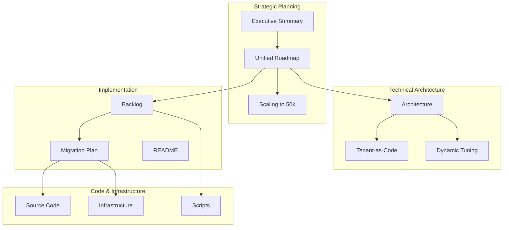

# AIPress Platform Documentation Index

## Overview

This document provides a comprehensive index of all AIPress platform documentation, organized by purpose and audience. All documentation has been aligned to support scaling from the current PoC to a production-ready platform hosting 50,000+ WordPress sites.

## Documentation Suite Structure

### 📋 **Planning & Strategy Documents**

#### [UNIFIED_ROADMAP.md](./UNIFIED_ROADMAP.md)
**Purpose**: Master roadmap bridging PoC to 50k scale  
**Audience**: All stakeholders  
**Key Content**:
- Current state vs. target architecture
- 4-phase development plan (12 months)
- Success metrics and risk mitigation
- Resource requirements and dependencies

#### [SCALING_TO_50K_SITES.md](./SCALING_TO_50K_SITES.md)
**Purpose**: Detailed technical plan for massive scale  
**Audience**: Technical teams, architects  
**Key Content**:
- GCP service limits and solutions
- Multi-project federation architecture
- Cost analysis ($2.64/site/month optimized)
- WordPress-specific scaling challenges
- Performance optimization strategies

#### [BACKLOG.md](./BACKLOG.md)
**Purpose**: Prioritized feature backlog aligned with scaling goals  
**Audience**: Development teams, product managers  
**Key Content**:
- Phase 0: Foundation refactoring (CRITICAL)
- Production readiness features
- Scale validation milestones
- Technical debt management

### 🏗️ **Architecture & Design Documents**

#### [ARCHITECTURE.md](./ARCHITECTURE.md)
**Purpose**: Production-scale architecture specification  
**Audience**: Architects, senior engineers  
**Key Content**:
- Multi-project federation model
- Meta control plane architecture
- Database and caching strategies
- AI-driven operations
- Global performance optimization

#### [TENANT_AS_CODE_DESIGN.md](./TENANT_AS_CODE_DESIGN.md)
**Purpose**: GitOps approach for WordPress management  
**Audience**: DevOps teams, platform engineers  
**Key Content**:
- Tenant YAML schema
- CI/CD pipeline design
- Git sync service architecture
- Environment management

#### [MIGRATION_PLAN.md](./MIGRATION_PLAN.md)
**Purpose**: Step-by-step migration from PoC to production  
**Audience**: Operations teams, project managers  
**Key Content**:
- 20-week migration timeline
- Risk mitigation strategies
- Rollback procedures
- Migration tools and scripts

### 📊 **Business & Strategic Documents**

#### [EXECUTIVE_SUMMARY.md](./EXECUTIVE_SUMMARY.md)
**Purpose**: High-level platform overview and vision  
**Audience**: Executives, stakeholders  
**Key Content**:
- Platform vision and value proposition
- Current architecture highlights
- Performance and cost optimization strategy
- Scaling outlook and business metrics

#### [DYNAMIC_RUNTIME_TUNING.md](./DYNAMIC_RUNTIME_TUNING.md)
**Purpose**: AI-driven performance optimization strategy  
**Audience**: AI/ML teams, performance engineers  
**Key Content**:
- AI-powered resource optimization
- Dynamic scaling algorithms
- Performance analytics and tuning

### 🔧 **Implementation Documents**

#### [README.md](./README.md)
**Purpose**: Project overview and getting started guide  
**Audience**: New team members, contributors  
**Key Content**:
- Platform overview
- Setup and deployment workflow
- Project structure
- Getting started instructions

#### Code Documentation
- **src/control-plane/**: Current control plane implementation
- **src/chatbot-backend/**: AI chatbot backend
- **src/chatbot-frontend/**: React frontend components
- **src/wordpress-runtime/**: WordPress container runtime
- **infra/**: Terraform infrastructure modules
- **scripts/**: Deployment and management scripts

## Document Relationships

## Documentation Status & Coherence

### ✅ **Aligned & Current**
- All documents updated for 50k scale architecture
- Consistent terminology and naming conventions
- Aligned timelines and success metrics
- Coherent technical approach across all docs

### 🔄 **Recently Updated**
- **BACKLOG.md**: Completely restructured for federation model
- **ARCHITECTURE.md**: Updated for production scale
- **UNIFIED_ROADMAP.md**: New comprehensive roadmap
- **MIGRATION_PLAN.md**: New migration strategy

### 📋 **Key Alignments Achieved**

#### **Architecture Consistency**
- Single project → Multi-project federation
- Dedicated databases → Shared instances with pooling
- Basic control plane → Meta + shard architecture
- Regional deployment → Global presence

#### **Timeline Alignment**
- Phase 0 (Months 1-2): Foundation refactoring
- Phase 1 (Months 3-4): Production readiness
- Phase 2 (Months 5-6): 1,000 sites validation
- Phase 3 (Months 7-9): 10,000 sites scale
- Phase 4 (Months 10-12): 50,000 sites + launch

#### **Cost Model Consistency**
- Target: <$3/site/month at scale
- Optimized: $2.64/site/month
- Achieved through: Shared resources, CUDs, AI optimization

## Reading Recommendations by Role

### **Executives & Stakeholders**
1. [EXECUTIVE_SUMMARY.md](./EXECUTIVE_SUMMARY.md) - Start here
2. [UNIFIED_ROADMAP.md](./UNIFIED_ROADMAP.md) - Implementation plan
3. [SCALING_TO_50K_SITES.md](./SCALING_TO_50K_SITES.md) - Scale validation

### **Technical Architects**
1. [ARCHITECTURE.md](./ARCHITECTURE.md) - Production architecture
2. [SCALING_TO_50K_SITES.md](./SCALING_TO_50K_SITES.md) - Technical details
3. [TENANT_AS_CODE_DESIGN.md](./TENANT_AS_CODE_DESIGN.md) - GitOps approach

### **Development Teams**
1. [UNIFIED_ROADMAP.md](./UNIFIED_ROADMAP.md) - Development phases
2. [BACKLOG.md](./BACKLOG.md) - Detailed features
3. [MIGRATION_PLAN.md](./MIGRATION_PLAN.md) - Implementation steps
4. [README.md](./README.md) - Getting started

### **Operations Teams**
1. [MIGRATION_PLAN.md](./MIGRATION_PLAN.md) - Migration procedures
2. [ARCHITECTURE.md](./ARCHITECTURE.md) - Operational architecture
3. [DYNAMIC_RUNTIME_TUNING.md](./DYNAMIC_RUNTIME_TUNING.md) - Performance tuning

### **Product Managers**
1. [UNIFIED_ROADMAP.md](./UNIFIED_ROADMAP.md) - Product roadmap
2. [BACKLOG.md](./BACKLOG.md) - Feature prioritization
3. [EXECUTIVE_SUMMARY.md](./EXECUTIVE_SUMMARY.md) - Business context

## Key Metrics & Success Criteria

### **Technical Metrics**
- **Scale**: 50,000+ WordPress sites
- **Performance**: <100ms response time globally
- **Availability**: 99.95% uptime (99.99% for Gold tier)
- **Cost**: <$2.64/site/month optimized

### **Business Metrics**
- **Time to Market**: 12-month implementation
- **Cost Efficiency**: 60% reduction vs. dedicated resources
- **Scalability**: Linear scaling to target
- **Customer Satisfaction**: >4.5/5 rating

### **Operational Metrics**
- **Deployment Frequency**: >10/day
- **Change Failure Rate**: <5%
- **Mean Time to Recovery**: <30 minutes
- **Automation Coverage**: >80%

## Next Steps

### **Immediate Actions (Week 1)**
1. Review all documentation with team leads
2. Validate technical architecture assumptions
3. Plan resource allocation for Phase 0
4. Set up development environment

### **Short-term Actions (Month 1)**
1. Begin Phase 0 implementation
2. Set up project hierarchy
3. Start meta control plane development
4. Implement monitoring foundations

### **Medium-term Goals (Quarter 1)**
1. Complete foundation refactoring
2. Migrate first pilot tenants
3. Validate shared database model
4. Establish operational procedures

## Conclusion

This documentation suite provides a comprehensive, coherent plan for scaling AIPress from a PoC to a production-ready platform hosting 50,000+ WordPress sites. All documents are aligned on:

- **Technical approach**: Multi-project federation with shared resources
- **Implementation timeline**: 12-month phased approach
- **Success metrics**: Performance, cost, and operational excellence
- **Risk mitigation**: Comprehensive planning and rollback procedures

The documentation enables teams to move forward with confidence, knowing that the architectural foundation can support massive scale while maintaining world-class performance and cost efficiency.
