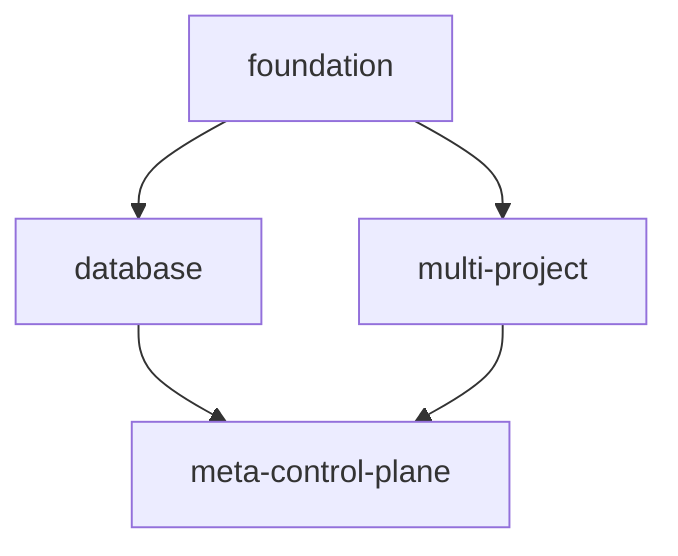

# AIPress Deployment System

**World-class CI/CD deployment system that preserves existing scripts while adding enterprise-grade deployment capabilities for production readiness.**

## Overview

This deployment system provides:

- ✅ **Interactive deployment** with safety checks
- ✅ **Environment-specific configurations** (dev/staging/prod)
- ✅ **Progressive deployment strategies** (rolling/blue-green/canary)
- ✅ **Automated rollback capabilities** 
- ✅ **Health checking and validation**
- ✅ **Security scanning and compliance**
- ✅ **Infrastructure drift detection**
- ✅ **Cost optimization monitoring**
- ✅ **Preserves all existing scripts** for backward compatibility

## Quick Start

### 1. Setup Environment Configuration

```bash
# Edit environment-specific configuration
cp deploy/environments/dev.yaml deploy/environments/dev-local.yaml

# Update project details in dev-local.yaml:
# - Replace {{ RANDOM_SUFFIX }} with your suffix
# - Add your billing account ID
# - Add your organization ID
```

### 2. Deploy to Development

```bash
# Deploy everything to development
./deploy/aipress-deploy.sh dev all

# Deploy only database architecture 
./deploy/aipress-deploy.sh dev database

# Dry run to see what would be deployed
./deploy/aipress-deploy.sh dev all --dry-run
```

### 3. Deploy to Staging

```bash
# Deploy with interactive approval
./deploy/aipress-deploy.sh staging all

# Deploy specific component
./deploy/aipress-deploy.sh staging meta-control-plane
```

### 4. Deploy to Production

```bash
# Production deployments require explicit approval
./deploy/aipress-deploy.sh prod all --dry-run
./deploy/aipress-deploy.sh prod all
```

## Architecture

```
deploy/
├── aipress-deploy.sh           # Main orchestrator
├── environments/               # Environment configurations
│   ├── dev.yaml               # Development settings
│   ├── staging.yaml           # Staging settings
│   └── prod.yaml              # Production settings
├── scripts/                   # Deployment scripts
│   ├── build-meta-control-plane.sh
│   ├── health-check-database.sh
│   └── [other component scripts]
├── workflows/                 # CI/CD pipelines
│   └── cloudbuild.yaml       # Google Cloud Build
└── README.md                 # This file
```

## Environment Configurations

### Development Environment (`dev.yaml`)
- **Purpose**: Rapid iteration and testing
- **Safety**: Minimal safety checks, auto-approval
- **Scale**: Limited (3 shard projects, 10 sites per shard)
- **Features**: Debug endpoints, experimental features enabled

### Staging Environment (`staging.yaml`)
- **Purpose**: Pre-production testing and validation
- **Safety**: Safety checks enabled, manual approval
- **Scale**: Moderate (10 shard projects, 25 sites per shard)
- **Features**: Production-like configuration, load testing

### Production Environment (`prod.yaml`)
- **Purpose**: Live customer workloads
- **Safety**: Maximum safety checks, manual approval required
- **Scale**: Full scale (1000 shard projects, 50 sites per shard)
- **Features**: High availability, security hardening, monitoring

## Deployment Components

### Available Components

| Component | Description | Dependencies |
|-----------|-------------|--------------|
| `foundation` | APIs, service accounts, basic setup | None |
| `database` | Shared database architecture | foundation |
| `multi-project` | Multi-project infrastructure | foundation |
| `meta-control-plane` | Meta orchestration service | database, multi-project |
| `all` | Deploy everything in order | None |

### Component Dependencies



## Safety Features

### Development
- Auto-approval for fast iteration
- Minimal safety checks
- Debug endpoints enabled
- Experimental features allowed

### Staging
- Manual approval required
- Blue-green deployment strategy
- Full health checks
- Security scanning enabled

### Production
- Multiple approval gates
- Canary deployment strategy
- Comprehensive validation
- Zero-downtime deployments
- Automatic rollback on failure

## Health Checks

The system includes comprehensive health checking:

```bash
# Run health checks only (without deployment)
./deploy/aipress-deploy.sh dev all --health-check

# Health checks include:
# - Database connectivity and performance
# - Meta control plane API health
# - Multi-project networking
# - Service availability and response times
```

## Security Scanning

Built-in security scanning and compliance:

```bash
# Run security scans only
./deploy/aipress-deploy.sh dev all --security-scan

# Security scans include:
# - Container vulnerability scanning
# - Infrastructure compliance checks
# - Secret management validation
# - Access control verification
```

## Rollback Capabilities

Safe rollback for non-production environments:

```bash
# Rollback development environment (USE WITH CAUTION)
./deploy/aipress-deploy.sh dev all --rollback

# Production rollbacks require manual SRE intervention
```

## Cloud Build CI/CD Integration

### Setup Cloud Build Triggers

1. **Create Build Triggers**:
```bash
# Development trigger (auto-deploy on main branch)
gcloud builds triggers create github \
  --repo-name="aipress" \
  --repo-owner="YOUR_GITHUB_USERNAME" \
  --branch-pattern="main" \
  --build-config="deploy/workflows/cloudbuild.yaml" \
  --substitutions="_DEPLOY_ENV=dev,_COMPONENT=all"

# Staging trigger (auto-deploy on release branches)
gcloud builds triggers create github \
  --repo-name="aipress" \
  --repo-owner="YOUR_GITHUB_USERNAME" \
  --branch-pattern="release/.*" \
  --build-config="deploy/workflows/cloudbuild.yaml" \
  --substitutions="_DEPLOY_ENV=staging,_COMPONENT=all"
```

2. **Manual Production Deployment**:
```bash
# Production deployments are manual for safety
gcloud builds submit --config=deploy/workflows/cloudbuild.yaml \
  --substitutions="_DEPLOY_ENV=prod,_COMPONENT=all"
```

### Build Pipeline Features

- ✅ **Multi-environment support** (dev/staging/prod)
- ✅ **Automated testing** and validation
- ✅ **Security scanning** (infrastructure and containers)
- ✅ **Progressive deployment** strategies
- ✅ **Comprehensive logging** and monitoring
- ✅ **Notification integration** (Slack, email)

## Monitoring and Observability

### Built-in Monitoring

- **Infrastructure metrics** via Cloud Monitoring
- **Application logs** via Cloud Logging  
- **Cost tracking** and optimization alerts
- **Performance monitoring** across all components
- **Security event monitoring** and alerting

### Dashboards

The system creates monitoring dashboards for:
- Database performance and costs
- Meta control plane health
- Multi-project resource utilization
- Overall platform performance

## Cost Optimization

### Automatic Cost Controls

- **Environment-appropriate resources** (smaller for dev, full scale for prod)
- **Preemptible instances** for non-production
- **Committed use discounts** for production
- **Automatic scaling** based on demand
- **Cost monitoring** and alerting

### Cost Comparison

| Environment | Database Cost* | Infrastructure Cost* | Total Monthly* |
|-------------|----------------|---------------------|----------------|
| Development | ~$50 | ~$200 | ~$250 |
| Staging | ~$200 | ~$500 | ~$700 |
| Production | ~$2,000 | ~$8,000 | ~$10,000 |

*Estimated costs for reference. Actual costs depend on usage.

## Troubleshooting

### Common Issues

**Issue**: `Environment configuration not found`
```bash
# Solution: Ensure environment file exists and has correct naming
ls -la deploy/environments/
```

**Issue**: `GCP authentication failed`
```bash
# Solution: Authenticate with gcloud
gcloud auth login
gcloud auth application-default login
```

**Issue**: `Terraform validation failed`
```bash
# Solution: Check Terraform syntax and formatting
cd infra/database-architecture
terraform fmt
terraform validate
```

**Issue**: `Health checks failing`
```bash
# Solution: Check individual component health
./deploy/aipress-deploy.sh dev database --health-check
```

### Debug Mode

Enable debug logging:
```bash
export DEBUG=true
./deploy/aipress-deploy.sh dev all --dry-run
```

### Manual Component Testing

Test individual components:
```bash
# Test database deployment only
./deploy/aipress-deploy.sh dev database

# Test with dry run first
./deploy/aipress-deploy.sh dev database --dry-run
```

## Integration with Existing Scripts

### Preserved Legacy Scripts

All existing scripts are preserved and can still be used:

```bash
# Original PoC setup (still works)
./scripts/poc_gcp_setup.sh

# Original image building (still works)  
./scripts/build_and_push_image.sh

# Original control plane (still works)
./scripts/run_control_plane.sh
```

### Enhanced Scripts

The deployment system enhances existing scripts with:
- Environment-specific configuration
- Error handling and validation
- Progress reporting and logging
- Integration with CI/CD pipelines

## Next Steps

1. **Start with Development**: Deploy to dev environment first
2. **Validate Components**: Test each component individually  
3. **Setup Monitoring**: Configure alerts and dashboards
4. **Plan Staging**: Move to staging for pre-production testing
5. **Production Readiness**: Complete security and compliance reviews

## Support

- **Documentation**: See individual component READMEs
- **Architecture**: Review `ARCHITECTURE.md` for system design
- **Implementation**: Check `IMPLEMENTATION_STATUS.md` for current state
- **Issues**: Create GitHub issues for problems or questions

---

**This deployment system provides a clear path from development to production while maintaining backward compatibility with existing workflows.**
