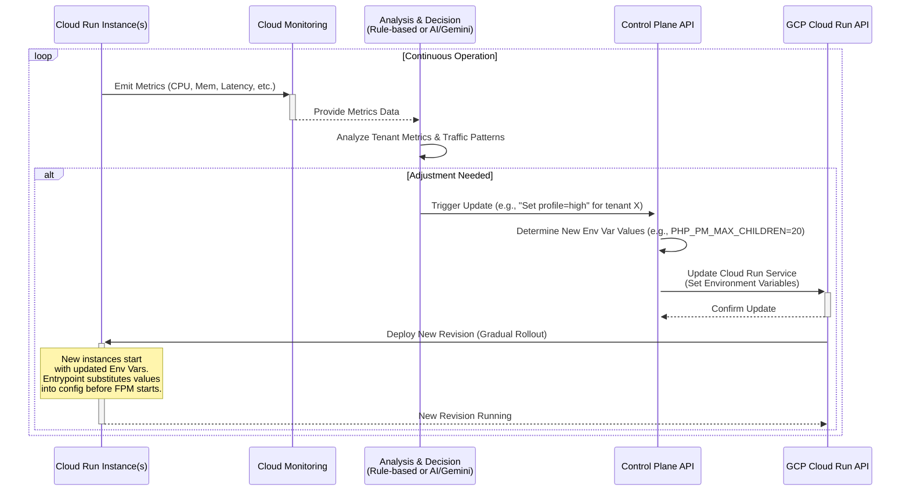

# Dynamic Runtime Tuning via Environment Variables for AIPress

## Goal

To enable dynamic adjustment of the WordPress runtime container's performance characteristics (primarily PHP-FPM settings) based on real-time needs (e.g., traffic load, resource utilization), allowing for fine-grained balancing of performance and cost without requiring container image rebuilds for tuning changes.

## Problem with Stateless Containers

Directly modifying configuration files (like PHP-FPM's `www.conf`) *inside* a running container instance on Cloud Run is impractical and goes against immutable infrastructure principles:

1.  **Statelessness:** Cloud Run instances are ephemeral. Changes made within a running instance are lost when the instance is shut down or replaced.
2.  **Immutability:** Container images are typically built to be immutable. Runtime configuration should ideally be injected externally.
3.  **Coordination:** Even if modification were possible, coordinating configuration reloads across multiple scaled-out instances would be complex.

## Solution: Environment Variable Substitution

The proposed solution leverages environment variables, which *can* be updated declaratively on a Cloud Run service definition, triggering a controlled rollout of new instances that adopt the new configuration on startup.

**Core Steps:**

1.  **Parameterize Configuration Files:** Modify the relevant configuration files (e.g., `src/wordpress-runtime/php-fpm/www.experimental.conf`) to use placeholders instead of hardcoded values for the settings we want to tune. The standard syntax for tools like `envsubst` is `${VARIABLE_NAME}`.

    *Example (`www.experimental.conf` modification):*
    ```ini
    ; ... other settings ...
    pm = dynamic

    ; --- Dynamic Tuning Settings ---
    ; Placeholders replaced by entrypoint script
    pm.max_children   = ${PHP_PM_MAX_CHILDREN}
    pm.start_servers  = ${PHP_PM_START_SERVERS}
    pm.min_spare_servers = ${PHP_PM_MIN_SPARE_SERVERS}
    pm.max_spare_servers = ${PHP_PM_MAX_SPARE_SERVERS}
    ; pm.max_requests = ${PHP_PM_MAX_REQUESTS} ; Optional

    ; ... other settings ...
    ```

2.  **Substitute Variables at Startup:** Modify the container's entrypoint script (`src/wordpress-runtime/docker-entrypoint.experimental.sh`) to:
    *   Define default values for the tuning environment variables (e.g., `PHP_PM_MAX_CHILDREN:=10`) in case they are not provided externally.
    *   Export these variables so they are available to the substitution tool.
    *   Use a tool like `envsubst` (provided by the `gettext` package) to read the parameterized configuration file, substitute the `${VARIABLE_NAME}` placeholders with the actual environment variable values, and write out the final configuration file *before* starting the main service (PHP-FPM).

    *Example (in `docker-entrypoint.experimental.sh`):*
    ```bash
    # --- Substitute Env Vars into PHP-FPM Config ---
    # Define defaults
    : "${PHP_PM_MAX_CHILDREN:=10}"
    : "${PHP_PM_START_SERVERS:=3}"
    : "${PHP_PM_MIN_SPARE_SERVERS:=2}"
    : "${PHP_PM_MAX_SPARE_SERVERS:=5}"
    export PHP_PM_MAX_CHILDREN PHP_PM_START_SERVERS PHP_PM_MIN_SPARE_SERVERS PHP_PM_MAX_SPARE_SERVERS

    FPM_CONF_TEMPLATE="/usr/local/etc/php-fpm.d/www.conf" # Path to file copied by Dockerfile

    echo "[Entrypoint] Substituting PHP-FPM pool config..."
    # Substitute only specified vars, create temp file, move over original, verify
    envsubst '${PHP_PM_MAX_CHILDREN} ${PHP_PM_START_SERVERS} ${PHP_PM_MIN_SPARE_SERVERS} ${PHP_PM_MAX_SPARE_SERVERS}' \
      < "$FPM_CONF_TEMPLATE" > "$FPM_CONF_TEMPLATE.tmp" && \
      mv "$FPM_CONF_TEMPLATE.tmp" "$FPM_CONF_TEMPLATE" && \
      echo "[Entrypoint] Overwrote $FPM_CONF_TEMPLATE with substituted values." && \
      echo "[Entrypoint] Verifying final config:" && \
      cat "$FPM_CONF_TEMPLATE" && \
      php-fpm -t || \
      { echo >&2 "[Entrypoint] ERROR: Substitution or final FPM config validation failed!"; exit 1; }

    # --- Start services ---
    echo "[Entrypoint] Starting PHP-FPM..."
    # PHP-FPM will now load the modified www.conf
    php-fpm -F &
    PHP_FPM_PID=$!
    # ... start nginx, wait ...
    ```

3.  **Install Substitution Tool:** Ensure the `gettext` package (which contains `envsubst`) is installed in the `Dockerfile.experimental`.

    *Example (`Dockerfile.experimental` modification):*
    ```dockerfile
    RUN apt-get update && apt-get install -y --no-install-recommends \
            nginx \
            coreutils \
            gettext \ # <-- Add gettext package
        && rm -rf /var/lib/apt/lists/*
    ```

4.  **Control Plane Orchestration:** The Control Plane API needs to be enhanced to manage these tuning settings.
    *   It would accept requests (e.g., via the Chatbot or an automated trigger) indicating a desired performance profile (e.g., "low-cost", "high-performance") or specific parameter values for a tenant.
    *   It translates this request into specific environment variable key-value pairs (e.g., `PHP_PM_MAX_CHILDREN=5` for low-cost, `PHP_PM_MAX_CHILDREN=20` for high-performance).
    *   It calls the GCP Cloud Run Admin API to update the specific tenant's service definition, merging the new tuning environment variables with the existing ones.

5.  **Cloud Run Deployment:** Upon detecting a change in the service definition (specifically, the environment variables), Cloud Run automatically initiates a new revision deployment. It gradually replaces old instances with new ones. These new instances boot up, execute the modified entrypoint script, perform the `envsubst` substitution, and start PHP-FPM with the newly configured settings.

6.  **Analysis & Decision Logic:** An external component is needed to decide *when* and *how* to tune:
    *   It monitors relevant metrics from Cloud Monitoring (CPU, memory, latency, PHP-FPM active/idle processes).
    *   It applies rules (e.g., "if average CPU > 80% for 5 mins, switch to high profile") or uses AI/Gemini to analyze patterns and recommend profile changes.
    *   It triggers the Control Plane API to apply the changes.

**Sequence Diagram:**



## Benefits

*   **No Image Rebuilds for Tuning:** Significantly faster deployment of performance adjustments.
*   **Leverages Cloud Run Native Updates:** Uses the standard, reliable mechanism for service updates and rollouts.
*   **Granular Control:** Allows fine-tuning resource usage *within* instances, potentially optimizing costs better than instance scaling alone.
*   **Traceability:** Configuration changes are tracked as Cloud Run revisions.
*   **Simplified Rollbacks:** Reverting tuning changes is as simple as redeploying a previous Cloud Run revision.
*   **Infrastructure as Code Alignment:** Configuration templates are version-controlled; the dynamic values are managed externally by the Control Plane based on operational state.

## Implementation Requirements

1.  **Configuration File:** Modify `www.experimental.conf` (or a dedicated template) with `${VAR}` placeholders.
2.  **Entrypoint Script:** Modify `docker-entrypoint.experimental.sh` to include `envsubst` logic (define defaults, export vars, run `envsubst`, validate).
3.  **Dockerfile:** Add `gettext` package installation to `Dockerfile.experimental`.
4.  **Control Plane API:** Add endpoint(s) to manage runtime tuning profiles/variables per tenant.
5.  **Control Plane Logic:** Implement logic to call GCP Cloud Run API to update service environment variables.
6.  **Analysis Logic:** Develop the system (scheduled function, AI integration) to monitor metrics and trigger Control Plane API calls.
7.  **Monitoring:** Ensure detailed metrics (CPU, memory, FPM processes) are collected and available for analysis.
