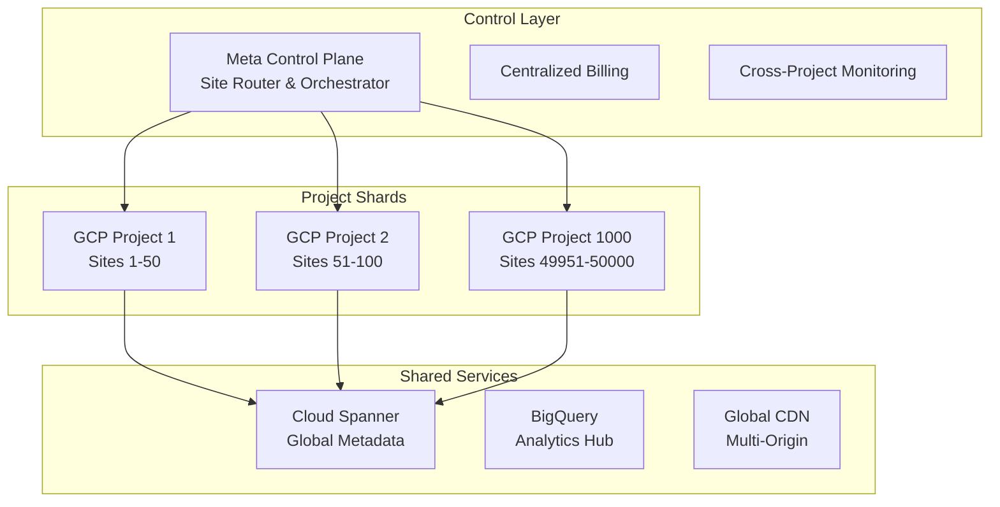
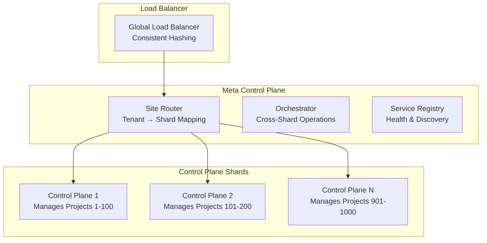
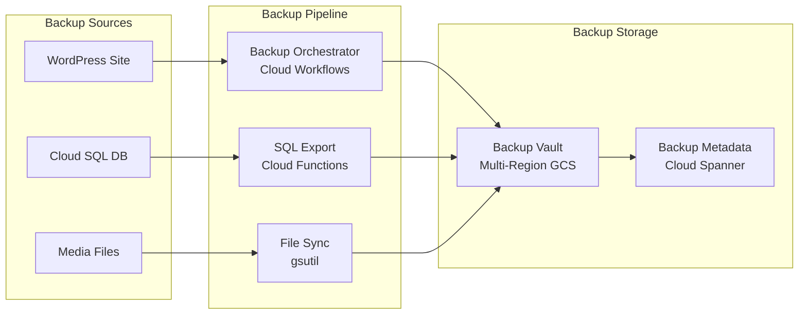
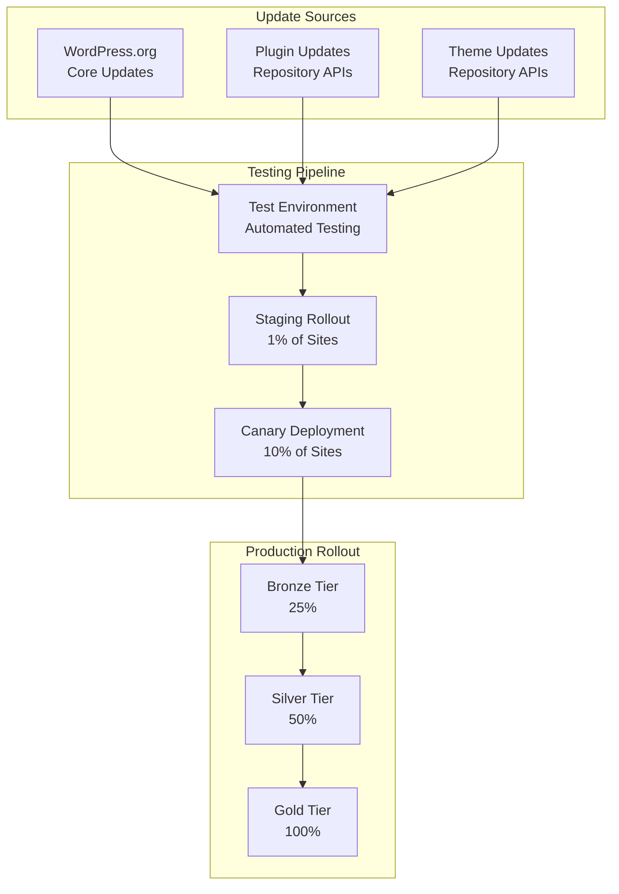
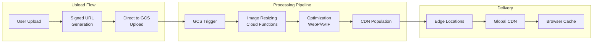
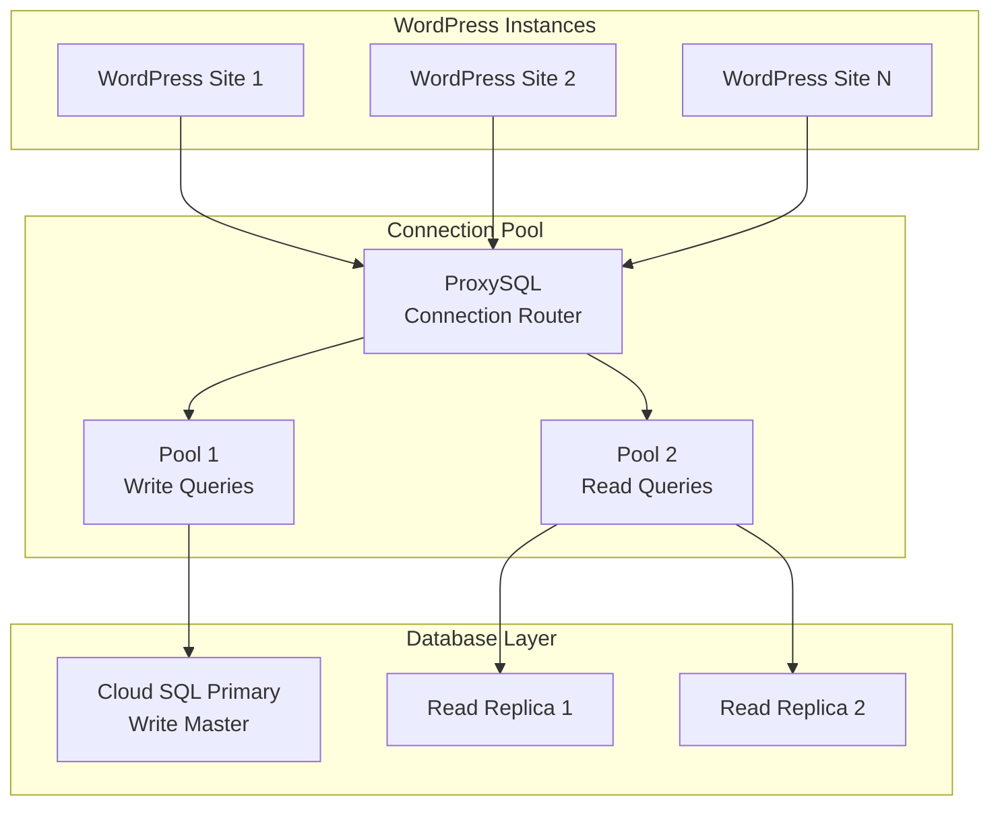

# AIPress: Scaling to 50,000+ WordPress Sites

## Executive Summary

This document outlines the architectural strategy, technical requirements, and implementation plan for scaling AIPress to host 50,000+ WordPress sites while maintaining world-class performance and operational excellence on Google Cloud Platform.

## Table of Contents

1. [Current Architecture Analysis](#current-architecture-analysis)
2. [GCP Service Limits & Constraints](#gcp-service-limits--constraints)
3. [Revised Architecture for 50k Scale](#revised-architecture-for-50k-scale)
4. [WordPress-Specific Challenges](#wordpress-specific-challenges)
5. [Performance Optimization Strategy](#performance-optimization-strategy)
6. [Cost Analysis & Optimization](#cost-analysis--optimization)
7. [Implementation Roadmap](#implementation-roadmap)
8. [Operational Considerations](#operational-considerations)
9. [Risk Assessment & Mitigation](#risk-assessment--mitigation)

## Current Architecture Analysis

### Strengths
- **Serverless Foundation**: Cloud Run provides excellent auto-scaling
- **Stateless Design**: Database and files externalized to managed services
- **Multi-tenant Isolation**: Dedicated resources per tenant
- **Infrastructure as Code**: Terraform-based provisioning

### Current Limitations for 50k Scale
- **Single Project Model**: GCP service limits prevent 50k services in one project
- **Terraform State Management**: Single state file doesn't scale
- **Control Plane Bottleneck**: Single instance managing all tenants
- **Database Connection Limits**: Dedicated SQL instances won't scale cost-effectively

## GCP Service Limits & Constraints

### Critical Limits That Impact 50k Scale

| Service | Current Limit | Impact | Solution |
|---------|---------------|--------|----------|
| Cloud Run Services/Project | 1,000 | Hard blocker | Multi-project federation |
| Cloud SQL Instances/Project | 100 | Cost inefficient | Shared instances with DB-per-tenant |
| Cloud SQL Connections/Instance | 4,000 | Performance bottleneck | Connection pooling |
| Terraform Workspaces | No limit | Management complexity | State sharding |
| IAM Policies/Project | 1,500 | Moderate constraint | Service account optimization |

### Quota Increases Required

```yaml
quotaRequests:
  - service: compute.googleapis.com
    metric: CPUS
    value: 500000  # For Cloud Run across all projects
  
  - service: sqladmin.googleapis.com
    metric: sql_instances
    value: 2000    # Across all projects
  
  - service: redis.googleapis.com
    metric: memory_gb
    value: 10000   # Total Memorystore capacity
```

## Revised Architecture for 50k Scale

### 1. Project Federation Model



### 2. Architecture Components

#### **Project Structure**
```
Organization: aipress-hosting
├── Billing Account: aipress-billing
├── Folder: production
│   ├── Project: aipress-control-meta
│   ├── Project: aipress-shared-services
│   ├── Project: aipress-shard-001 (Sites 1-50)
│   ├── Project: aipress-shard-002 (Sites 51-100)
│   └── Project: aipress-shard-1000 (Sites 49951-50000)
└── Folder: staging
    └── Project: aipress-staging
```

#### **Per-Project Resource Allocation**
```yaml
perProjectResources:
  sites: 50
  cloudRun:
    services: 50
    maxInstances: 2000  # 40 per service avg
  
  cloudSQL:
    instances: 1        # Shared high-memory instance
    databases: 50       # One per site
    connections: 2000   # With connection pooling
  
  memorystore:
    instances: 1        # Shared Redis instance
    databases: 50       # One per site
    memory: 8GB
  
  cloudStorage:
    buckets: 1          # Shared bucket with tenant prefixes
    totalStorage: 1TB   # Avg 20GB per site
```

### 3. Sharded Control Plane Architecture



#### **Tenant-to-Shard Mapping**
```python
def get_shard_for_tenant(tenant_id: str) -> str:
    """Consistent hashing for tenant-to-shard mapping"""
    tenant_hash = hashlib.sha256(tenant_id.encode()).hexdigest()
    shard_number = int(tenant_hash[:8], 16) % NUM_SHARDS + 1
    return f"aipress-shard-{shard_number:03d}"

def get_control_plane_for_shard(shard_id: str) -> str:
    """Map shard to control plane instance"""
    shard_num = int(shard_id.split('-')[-1])
    cp_group = (shard_num - 1) // SHARDS_PER_CP + 1
    return f"control-plane-{cp_group}"
```

## WordPress-Specific Challenges

### 1. Backup & Restore System

#### **Architecture**


#### **Implementation**
```yaml
backupStrategy:
  schedule:
    full: "0 2 * * 0"     # Weekly full backup
    incremental: "0 2 * * 1-6"  # Daily incremental
    realtime: true        # Transaction log shipping
  
  components:
    database:
      method: cloud-sql-export
      format: sql
      compression: gzip
      encryption: customer-managed
    
    files:
      method: rsync
      source: gs://${TENANT_ID}-media/
      destination: gs://aipress-backups/${TENANT_ID}/files/
      versioning: true
    
    configuration:
      method: api-export
      includes:
        - wp-config.php
        - .htaccess
        - active plugins/themes
        - custom settings
  
  retention:
    daily: 30
    weekly: 52
    monthly: 12
    yearly: 7
  
  testing:
    frequency: monthly
    automated: true
    validation:
      - database_integrity
      - file_completeness
      - restoration_time
```

### 2. WordPress Updates at Scale

#### **Update Pipeline**


#### **Update Strategy**
```yaml
updateStrategy:
  core:
    frequency: "within 72 hours"
    testing:
      automated: true
      duration: 24h
      rollback: automatic
    
    rollout:
      waves:
        - tier: development
          percentage: 100
          duration: 24h
        - tier: bronze
          percentage: 25
          duration: 48h
        - tier: silver
          percentage: 50
          duration: 48h
        - tier: gold
          percentage: 100
          duration: 72h
  
  plugins:
    strategy: "conservative"
    testing:
      compatibility: automated
      security: manual-review
    
    approval:
      auto: security-updates
      manual: feature-updates
  
  themes:
    strategy: "manual-approval"
    testing: comprehensive
```

### 3. Media Handling & Performance

#### **Stateless Media Architecture**


#### **Media Optimization Pipeline**
```yaml
mediaOptimization:
  upload:
    directToGCS: true
    signedUrls: true
    maxFileSize: 100MB
    allowedTypes: [jpg, png, gif, webp, pdf, mp4]
  
  processing:
    resizing:
      sizes: [150, 300, 768, 1024, 1536, 2048]
      formats: [webp, jpg]
      quality: 85
    
    optimization:
      images: imageio
      videos: ffmpeg
      compression: automatic
  
  delivery:
    cdn: cloud-cdn
    caching:
      static: 1year
      dynamic: 1hour
    
    transforms:
      onTheFly: true
      parameters: [w, h, q, f]  # width, height, quality, format
```

### 4. Plugin Compatibility Matrix

#### **Compatibility Classification**
```yaml
pluginCompatibility:
  fullSupport:
    - database-only-plugins
    - api-based-plugins
    - modern-stateless-plugins
    - seo-plugins
    - analytics-plugins
  
  limitedSupport:
    - caching-plugins  # Use Redis instead
    - backup-plugins   # Use platform backup
    - security-plugins # Integrate with Cloud Armor
  
  notSupported:
    - file-based-caching
    - local-file-generation
    - server-specific-plugins
    - htaccess-modifying-plugins
  
  alternatives:
    caching:
      wpRocket: redis-object-cache
      w3TotalCache: memorystore-integration
    
    backup:
      updraftPlus: platform-backup-service
      backupBuddy: automated-gcs-backup
    
    security:
      wordfence: cloud-armor-integration
      sucuri: managed-security-service
```

## Performance Optimization Strategy

### 1. Database Performance at Scale

#### **Connection Pool Architecture**


#### **Database Optimization Configuration**
```yaml
databaseOptimization:
  cloudSQL:
    tier: db-custom-16-65536  # 16 vCPU, 64GB RAM
    storage: ssd
    storageSize: 2TB
    storageAutoResize: true
    
    settings:
      innodb_buffer_pool_size: "48GB"
      innodb_log_file_size: "2GB"
      query_cache_size: "256MB"
      max_connections: 2000
      
    backups:
      automated: true
      startTime: "02:00"
      pointInTimeRecovery: true
      
    monitoring:
      insights: enabled
      slowQueryLog: enabled
      slowQueryThreshold: 2s
  
  connectionPooling:
    tool: ProxySQL
    configuration:
      maxConnections: 1500
      maxConnectionsPerHost: 100
      queryTimeout: 30s
      connectionTimeout: 5s
      
    rules:
      - pattern: "^SELECT.*"
        destination: "read-replicas"
      - pattern: "^(INSERT|UPDATE|DELETE).*"
        destination: "primary"
```

### 2. Caching Strategy

#### **Multi-Layer Caching Architecture**
```
┌─────────────────────────────────────────────────────────────┐
│                    Browser Cache (L4)                       │
│                        7 days                               │
└─────────────────────────────────────────────────────────────┘
┌─────────────────────────────────────────────────────────────┐
│                  Cloud CDN (L3)                            │
│                     1 hour - 1 year                        │
└─────────────────────────────────────────────────────────────┘
┌─────────────────────────────────────────────────────────────┐
│              Memorystore Redis (L2)                        │
│                    30 minutes                              │
└─────────────────────────────────────────────────────────────┘
┌─────────────────────────────────────────────────────────────┐
│                PHP OpCache (L1)                            │
│                    In Memory                               │
└─────────────────────────────────────────────────────────────┘
```

#### **Cache Configuration**
```yaml
cachingStrategy:
  php:
    opcache:
      memory_consumption: 512M
      max_accelerated_files: 20000
      validate_timestamps: false
      
  redis:
    instance: redis-cluster
    memory: 8GB
    policy: allkeys-lru
    
    wordpress:
      objectCache: true
      transients: true
      sessions: true
      ttl:
        default: 1800s
        long: 3600s
        short: 300s
  
  cdn:
    provider: cloud-cdn
    origins:
      - cloud-run
      - cloud-storage
    
    caching:
      static: 31536000s  # 1 year
      dynamic: 3600s     # 1 hour
      api: 0s            # No cache
    
    compression:
      gzip: true
      brotli: true
```

### 3. Global Load Distribution

#### **Multi-Region Strategy**
```yaml
globalDeployment:
  regions:
    primary:
      region: us-central1
      traffic: 40%
      services:
        - control-plane
        - database-primary
        - cdn-origin
    
    secondary:
      - region: europe-west1
        traffic: 35%
        services:
          - read-replicas
          - cdn-edge
          - backup-storage
      
      - region: asia-northeast1
        traffic: 25%
        services:
          - read-replicas
          - cdn-edge
          - disaster-recovery
  
  routing:
    algorithm: latency-based
    healthChecks: enabled
    failover: automatic
    
  performance:
    targetLatency: <100ms
    availabilityTarget: 99.95%
    errorRateTarget: <0.1%
```

## Cost Analysis & Optimization

### 1. Cost Breakdown (50,000 Sites)

#### **Monthly Cost Estimate**
```yaml
monthlyCosts:
  compute:
    cloudRun:
      vCPU: 100000      # 2 vCPU avg per site
      memory: 200000    # 4GB avg per site
      requests: 500M    # 10k per site per month
      cost: $75000
    
    controlPlane:
      instances: 50     # Sharded control planes
      cost: $5000
  
  database:
    cloudSQL:
      instances: 1000   # One per project
      storage: 2000TB   # 40GB avg per site
      cost: $150000
  
  storage:
    cloudStorage:
      storage: 1000TB   # 20GB avg per site
      operations: 100M  # File operations
      egress: 500TB    # CDN and downloads
      cost: $45000
  
  cache:
    memorystore:
      instances: 1000
      memory: 8000GB   # 8GB per instance
      cost: $25000
  
  networking:
    loadBalancer: $5000
    cdn: $15000
    premium_tier: $10000
    cost: $30000
  
  operations:
    monitoring: $5000
    logging: $10000
    security: $5000
    cost: $20000

total:
  monthly: $350000
  perSite: $7.00
  annual: $4200000
```

#### **Cost Optimization Strategies**
```yaml
optimization:
  commitments:
    cloudRun:
      commitment: 3-year
      discount: 57%
      savings: $42750/month
    
    cloudSQL:
      commitment: 3-year
      discount: 57%
      savings: $85500/month
    
    storage:
      lifecycle: enabled
      nearline_after: 30days
      coldline_after: 365days
      savings: $15000/month
  
  rightSizing:
    automated: true
    frequency: weekly
    savings: $25000/month
  
  tiering:
    bronze: scale-to-zero
    silver: min-instances-1
    gold: dedicated-resources
    avgSavings: $50000/month

totalSavings: $218250/month
optimizedCost: $131750/month
perSiteOptimized: $2.64/month
```

### 2. Resource Tiering Strategy

#### **Service Tiers**
```yaml
serviceTiers:
  bronze:
    price: $2/month
    features:
      - shared-resources
      - scale-to-zero
      - basic-support
      - 99.9%-sla
    limits:
      storage: 5GB
      bandwidth: 50GB
      visits: 10000
  
  silver:
    price: $5/month
    features:
      - dedicated-compute
      - min-instances-1
      - priority-support
      - 99.95%-sla
    limits:
      storage: 25GB
      bandwidth: 250GB
      visits: 100000
  
  gold:
    price: $15/month
    features:
      - dedicated-everything
      - enterprise-support
      - 99.99%-sla
      - white-glove-migration
    limits:
      storage: 100GB
      bandwidth: 1TB
      visits: 1000000
```

## Implementation Roadmap

### Phase 1: Foundation (Months 1-3)

#### **Month 1: Project Federation Setup**
- [ ] Design project hierarchy and naming
- [ ] Set up billing account and organization
- [ ] Create first 10 project shards
- [ ] Implement project creation automation
- [ ] Set up cross-project networking

#### **Month 2: Meta Control Plane**
- [ ] Develop meta control plane service
- [ ] Implement tenant-to-shard routing
- [ ] Create project management APIs
- [ ] Set up Cloud Spanner for metadata
- [ ] Build service discovery mechanism

#### **Month 3: Database Sharding**
- [ ] Implement shared Cloud SQL instances
- [ ] Set up connection pooling with ProxySQL
- [ ] Configure read replicas
- [ ] Implement database per tenant model
- [ ] Create migration tools

### Phase 2: WordPress Optimization (Months 4-6)

#### **Month 4: Backup System**
- [ ] Design backup architecture
- [ ] Implement Cloud Workflows orchestrator
- [ ] Create backup verification system
- [ ] Set up cross-region replication
- [ ] Build restore automation

#### **Month 5: Media Pipeline**
- [ ] Implement direct-to-GCS uploads
- [ ] Create image optimization pipeline
- [ ] Set up CDN integration
- [ ] Build media transformation service
- [ ] Implement lazy loading

#### **Month 6: Plugin Compatibility**
- [ ] Audit popular WordPress plugins
- [ ] Create compatibility framework
- [ ] Develop alternative solutions
- [ ] Build plugin testing automation
- [ ] Create migration tools

### Phase 3: Global Scale (Months 7-9)

#### **Month 7: Multi-Region Deployment**
- [ ] Set up regional clusters
- [ ] Implement global load balancing
- [ ] Configure cross-region replication
- [ ] Set up disaster recovery
- [ ] Optimize network routing

#### **Month 8: Performance Optimization**
- [ ] Implement advanced caching
- [ ] Optimize database queries
- [ ] Set up auto-scaling policies
- [ ] Create performance monitoring
- [ ] Implement A/B testing framework

#### **Month 9: Operations at Scale**
- [ ] Build comprehensive monitoring
- [ ] Implement alerting system
- [ ] Create operational dashboards
- [ ] Set up automated remediation
- [ ] Build capacity planning tools

### Phase 4: Production Readiness (Months 10-12)

#### **Month 10: Security & Compliance**
- [ ] Implement security scanning
- [ ] Set up compliance monitoring
- [ ] Create audit logging
- [ ] Implement data encryption
- [ ] Build incident response

#### **Month 11: Testing & Validation**
- [ ] Create load testing framework
- [ ] Implement chaos engineering
- [ ] Build integration tests
- [ ] Perform disaster recovery tests
- [ ] Validate backup/restore

#### **Month 12: Launch Preparation**
- [ ] Complete documentation
- [ ] Train operations team
- [ ] Set up customer support
- [ ] Implement billing integration
- [ ] Execute go-live plan

## Operational Considerations

### 1. Monitoring & Observability

#### **Monitoring Stack**
```yaml
monitoring:
  metrics:
    collection:
      - cloud-monitoring
      - prometheus
      - custom-metrics
    
    aggregation:
      tool: prometheus
      retention: 90days
      
    dashboards:
      platform: grafana
      dashboards:
        - platform-overview
        - per-tenant-metrics
        - infrastructure-health
        - cost-analysis
  
  logging:
    collection: cloud-logging
    retention: 30days
    export: bigquery
    
    structured:
      format: json
      fields:
        - tenant_id
        - region
        - service
        - severity
        - message
  
  tracing:
    tool: cloud-trace
    sampling: 0.1%
    retention: 7days
  
  alerting:
    channels:
      - email
      - slack
      - pagerduty
    
    rules:
      - name: high-error-rate
        condition: error_rate > 1%
        severity: warning
      
      - name: service-down
        condition: availability < 99%
        severity: critical
```

### 2. Disaster Recovery

#### **RTO/RPO Targets**
```yaml
disasterRecovery:
  targets:
    rto: 4hours    # Recovery Time Objective
    rpo: 1hour     # Recovery Point Objective
  
  scenarios:
    regionFailure:
      detection: automated
      failover: automatic
      duration: 15minutes
    
    dataCorruption:
      detection: monitoring
      recovery: point-in-time
      duration: 2hours
    
    completeOutage:
      detection: health-checks
      recovery: full-rebuild
      duration: 4hours
  
  testing:
    frequency: quarterly
    scope: full-stack
    automation: 80%
```

### 3. Capacity Planning

#### **Growth Projections**
```yaml
capacityPlanning:
  growth:
    sites:
      month1: 1000
      month6: 10000
      month12: 25000
      month24: 50000
    
    traffic:
      avgPerSite: 10000/month
      peakMultiplier: 5x
      seasonality: 2x
  
  resources:
    compute:
      baseline: 50000_vcpu
      peak: 250000_vcpu
      scaling: auto
    
    storage:
      baseline: 1000TB
      growth: 100TB/month
      cleanup: automated
    
    network:
      bandwidth: 10Gbps
      burst: 50Gbps
      regions: 3
```

## Risk Assessment & Mitigation

### 1. Technical Risks

| Risk | Probability | Impact | Mitigation |
|------|-------------|---------|------------|
| GCP Quota Limits | High | High | Proactive quota management, multi-region |
| Database Bottlenecks | Medium | High | Connection pooling, read replicas |
| WordPress Incompatibility | Medium | Medium | Compatibility testing, alternatives |
| State Management | High | Medium | Sharded state, eventual consistency |
| Security Vulnerabilities | Low | High | Automated scanning, rapid patching |

### 2. Business Risks

| Risk | Probability | Impact | Mitigation |
|------|-------------|---------|------------|
| Cost Overruns | Medium | High | Detailed monitoring, automated optimization |
| Customer Churn | Low | High | Excellent support, migration tools |
| Competitive Pressure | High | Medium | Continuous innovation, AI differentiation |
| Regulatory Changes | Low | High | Compliance monitoring, legal review |
| Vendor Lock-in | Medium | Medium | Multi-cloud strategy, open standards |

### 3. Operational Risks

| Risk | Probability | Impact | Mitigation |
|------|-------------|---------|------------|
| Team Scaling | High | High | Training programs, documentation |
| Complexity Management | High | Medium | Automation, standardization |
| Knowledge Silos | Medium | Medium | Cross-training, documentation |
| Burnout | Medium | High | Automation, proper staffing |
| Communication | Medium | Medium | Clear processes, tools |

## Success Metrics

### 1. Technical KPIs
- **Availability**: 99.95% uptime across all sites
- **Performance**: <100ms response time globally
- **Scalability**: Linear scaling to 50k sites
- **Recovery**: <4 hour RTO, <1 hour RPO

### 2. Business KPIs
- **Cost per Site**: <$3/month average
- **Customer Satisfaction**: >4.5/5 rating
- **Migration Success**: >95% success rate
- **Support Resolution**: <24 hour response

### 3. Operational KPIs
- **Deployment Frequency**: >10/day
- **Change Failure Rate**: <5%
- **Mean Time to Recovery**: <30 minutes
- **Automation Coverage**: >80%

## Conclusion

Scaling AIPress to 50,000+ WordPress sites is technically achievable with the proposed architecture. The key success factors are:

1. **Project Federation**: Overcoming GCP service limits through multi-project architecture
2. **Database Strategy**: Shared instances with connection pooling for cost efficiency
3. **WordPress Adaptation**: Solving stateless compatibility challenges
4. **Global Performance**: Multi-region deployment with intelligent routing
5. **Operational Excellence**: Comprehensive monitoring and automation

The estimated cost of $2.64/site/month (with optimizations) provides a competitive foundation for a profitable hosting business while delivering world-class performance and reliability.

The 12-month implementation roadmap provides a structured approach to achieving this scale while maintaining system stability and customer satisfaction throughout the growth journey.
